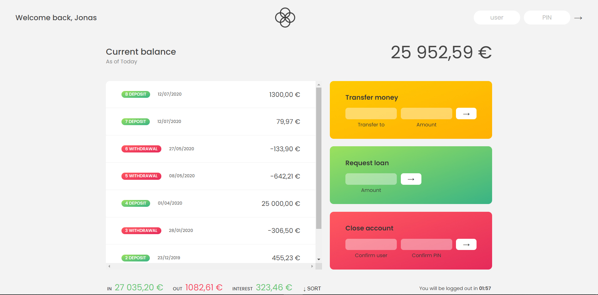

# 🏦 Bankist-App 🏦


## User Details 👨‍🎓

- Username: js  
  Password: 1111
- Username: jd  
  Password: 2222

## Project Description 📑

- This is a minimal banking app for basic banking needs.
- We need to login with registered credentials.
- We can apply for loan and send money to another user.
- We'll get the requested loan amount in some time.
- We can close the account if we want to.
- We'll be logged-out on being inactive for 2 minutes.

## License ✅

[**MIT**](https://github.com/Anubhavdxt/Bankist-App/blob/master/LICENSE)

## Tech Stack 💻

- **Vanilla Javascript**
- **HTML5**
- **CSS3**

## Screenshots 📸




## Lessons Learned 🖥️

- **`DOM` manipulation**
  - **`document object`** to manipulate the _HTML elements_
  - **`querySelector() method`** to select the _HTML elements_
  - **`addEventListener() method`** to listen the _button-clicks_
  - **`classList property`** for the list of _class_ in an _HTML_ tag
  - **`remove() method`** to remove a _class_ from _HTML_ tags
  - **`add() method`** to add a _class_ to _HTML_ tags
  - **`innerHTML property`** to manipulate the _HTML code_
  - **`innerText property`** to change the _text_
- **`Math` Object**
  - **`random() method`** to generate the secret number from the given range
  - **`trunc() method`** to make randomly generated numbers an integer
- **`Internationalization` API**
  - **`Intl namespace`**
- **`localStorage` API**
  - **`setItem() method`** to save _High Score_ data to **`localStorage`**
  - **`getItem() method`** to retrieve _High Score_ data from **`localStorage`** on the start

## Optimizations 📊

**1. Refactors:**
Arranged and grouped all the _variables_, _selectors_, _functions_ and _event listeners_ together.

**2. Performance improvement:** 📈
Created _functions_ for the _repetitive code_ & _specific tasks_.

## Run Locally 🧑‍💻

Clone the project

```bash
  git clone https://github.com/Anubhavdxt/Bankist-App
```

Go to the project directory

```bash
  cd Bankist-App
```

Install live-server

```bash
  npm i live-server
```

Start the server

```bash
  live-server
```

## Contributing 🤝

Contributions are what make the open source community such an amazing place to be learn, inspire, and create. Any contributions you make are greatly appreciated.

1. Fork the Project
2. Create your Feature Branch

   ```git
   git checkout -b feature/AmazingFeature
   ```

3. Commit your Changes

   ```git
   git commit -m 'Add some AmazingFeature
   ```

4. Push to the Branch

   ```git
   git push origin feature/AmazingFeature
   ```

5. Open a Pull Request

## Support 📧

For support, email anubhavdxt46@gmail.com.

## Acknowledgements 🙏

- [**_Jonas Schmedtmann_**](https://www.udemy.com/user/jonasschmedtmann/) (**_Original Project_**)
- [Udemy](https://www.udemy.com)

## Authors 👨‍💻

- [**@Anubhavdxt**](https://www.github.com/Anubhavdxt)
